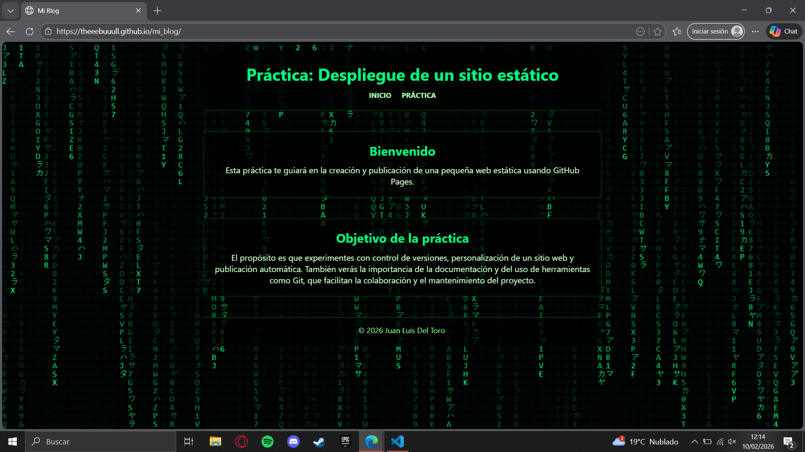

# Práctica UT6: Despliegue de un sitio estático en GitHub Pages

## Fase 1 – Preparación local y primer commit

En esta fase he creado la carpeta del proyecto y he insrtsdo los archivos por defecto que venían en la práctica.  
Después inicialicé el repositorio Git con `git init`, configuré mi identidad de usuario y añadí un archivo `.gitignore`.  
Finalmente realicé el primer commit con la plantilla base del sitio.  

---

## Fase 2 – Repositorio remoto y primer push

En esta fase he creado el repositorio en GitHub y lo he vinculado con mi proyecto local mediante HTTPS.  
He realizado una pequeña modificación en los archivos y he subido los cambios al repositorio remoto con `git push`.  

Lo más importante aprendido ha sido cómo conectar un repositorio local con GitHub.

- **Dificultades:** al realizar el primer push tuve que comprobar que el repositorio remoto estaba correctamente vinculado y entender cómo funciona la autenticación automática de Git en Windows.

---

## Fase 3 – Personalización del sitio y commits atómicos

En esta fase he personalizado mi blog cambiando practicamente todo el index y css para hacerlo al estilo de la pelicula matrix, y también he modificado el JavaScript para hacer que el fondo tenga ese estilo en cascada.  
Cada grupo de cambios se guardó en un commit separado, de forma que el historial sea más claro y fácil de seguir.

Lo más importante que he aprendido ha sido hacer commits atómicos y comprobar que los cambios en HTML, CSS y JS se reflejan correctamente en el navegador.

- **Dificultades:** asegurarme de que las rutas a CSS y JS seguían funcionando después de reorganizar y modificar archivos.

---

## Fase 4 – Publicación con GitHub Pages

En esta fase he publicado mi blog usando GitHub Pages.  
He activado la publicación desde la rama `main` y la carpeta raíz del proyecto, y comprobé que la página se muestra correctamente en la URL pública proporcionada por GitHub.

- **Dificultades:** al principio tuve que esperar unos minutos hasta que GitHub compiló y publicó la web, y verificar que todos los cambios se mostraban correctamente.

- Enlace: https://theeebuuull.github.io/mi_blog/

